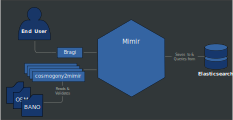

# Architecture

Mimirsbrunn is an open source project to develop a forward and reverse
geocoder. It is used by [Navitia](https://www.navitia.io/) and
[Qwant](https://www.qwant.com/maps/) to enable, among other functionalities,
autocompletion for geospatial data. Mimirsbrunn uses
[Elasticsearch](https://www.elastic.co/elasticsearch) as its backend.

Currently Mimirsbrunn contains the following components:

* **Mimir** is a library to interact with the backend, mainly Elasticsearch,
  although the backend remains generic. The backend is essentially seen as a
  repository of containers holding documents. So, with Mimir, you can create
  containers, insert documents in containers, search documents over a list of
  containers, delete containers.

* **Places** is a library that contains much of the code related to geospatial
  data. It knows how to read OSM files, cosmogony and other formats, extract
  the data, transform it in a meaningful way.

* **Bragi** is a web server, presenting a REST API to query Mimir. It is
  concerned with translating queries from the user to Elasticsearch, and
  Elasticsearch's response back to the user.

* **Binaries** for each file format that we ingest in the backend through Mimir.
  These provide a command line interface which make use of *Places* and *Mimir*
  to validate and enrich the data prior to insertion into the backend.

The context diagram showing these two components is seen below:




## Hexagonal Architecture

We feel the hexagonal architecture has several benefits:
* It creates a known structure which is easy to communicate with.
* The structure enables better testing by allowing to use test doubles at key
  interfaces.
* The structure allows swapping external components.

The domain is the core of the hexagonal architecture. It contains all the
business logic. This domain interacts with external components through
**ports**. The domain does not depends on external components, but external
components may depend from the domain. These external components are
categorized as:
1. **primary** (or driving) when they make a request to the domain,
2. **secondary** (or driven) when the domain makes a request to them.

For example, a user interacts with the domain through a primary port, where as
the domain will persist data to a database through a seconday port. It is
customary to represent primary port on the left, and secondary port on the
right, as seen in the picture below.


The user, however, may use one of several mechanism to interact with a single
port: A graphical user interface, a REST interface, are but a few examples. We
need a component that takes these various mode of interaction and adapts them
to the targeted primary port. This is the job of **adapters**. They allow an
external component to communicate with the domain through a port. And just like
ports, you have primary adapters and secondary adapters. 

Primary adapters control the application / domain through primary ports. That's
why they are also called **controllers**. They are injected in their
constructor an object (which we'll call a **service**) whose class implements
the primary port's interface that the adapter requires. Sometimes primary
adapters are also called controllers.

Secondary adapters, on the other hand, directly implement a secondary port's interface.

The following diagram shows these components interacting together:


The main program will do the following:
1. Create an instance of the secondary adapter.
2. Create an instance of the service, passing it the instance of secondary adapter.
3. Create an instance of the controller, passing it the service.

## Mimir

Mimir, as we've seen in the introduction, is a library responsible for interacting with a backend.
Mimir is implemented using an hexagonal architecture, so at the top of Mimir, you'll find

```
src
    domain
    adapters
```

If you want to know what Mimir can do, suffices is to look at the primary ports:

```
src
    domain
        ports
	    primary
	        explain_query.rs
		generate_index.rs
		list_documents.rs
		search_documents.rs
```


Each of this functionality is implemented, in rust, as a trait. The trait exposes several functions,
which manipulate objects from the domain model. So, if we look at the `GenerateIndex` trait, it is
defined as such:

```rust
use crate::domain::model::{
    configuration::Configuration,
    error::Error as ModelError,
    index::{Index, IndexVisibility},
};

[...]

#[async_trait]
pub trait GenerateIndex {
    async fn generate_index<D: ContainerDocument + Send + Sync + 'static>(
        &self,
        config: Configuration,
        documents: impl Stream<Item = D> + Send + Sync + Unpin + 'static,
        visibility: IndexVisibility,
    ) -> Result<Index, ModelError>;
}
```


## Global picture

Mimirsbrunn is composed of several [parts](https://github.com/CanalTP/mimirsbrunn/blob/master/documentation/components.md): some of them manage the data import in Elasticsearch while a web service ([bragi](https://github.com/CanalTP/mimirsbrunn/blob/master/src/bin/bragi.rs)) wraps Elasticsearch interactions in order to return formated responses (using [geocodejson](https://github.com/geocoders/geocodejson-spec) as the responses format)


For more detail about the different parts, check the [components documentation](https://github.com/CanalTP/mimirsbrunn/blob/master/documentation/components.md).

Note: on the diagram:
* OSM stands for [OpenStreetMap](osm.org)
* OA stands for [OpenAddresses](openaddresses.io)
* NTFS stands for [Navitia Transit Feed Specification](https://github.com/CanalTP/navitia/blob/dev/documentation/ntfs/ntfs_0.6.md)
* Bano stands for [Base d'Adresses Nationale Ouverte](https://www.data.gouv.fr/en/datasets/base-d-adresses-nationale-ouverte-bano/)

## Indexes Architecture

Data are imported in multiple indexes with this structure:
```
munin -> munin_addr -> munin_addr_dataset1 -> munin_addr_dataset1_20160101T123200
     |             |-> munin_addr_dataset2 -> munin_addr_dataset2_20160101T123200
     |-> munin_admin  -> munin_admin_dataset1  -> munin_admin_dataset1_20160101T123200
     |-> munin_street -> munin_street_dataset1 -> munin_street_dataset1_20160101T123200
```

Munin is the root index, it's an alias used by the frontend (bragi), itself pointing to an index for each dataset/document type.  
So if we have address data for France and Belgium we will have two indexes: "addr_fr" and "addr_be". These are also aliases, they point to a dated index, this way we can import data in another index without impacting anyone, then switch the alias to point to the new data.  
This will give us the ability to only import a part of the world without any downtime.

During an update the indexes will be (for the previous example say we update addr_dataset1):

- During the data update:
  ```
                                                munin_addr_dataset1_20160201T123200
  munin -> munin_addr -> munin_addr_dataset1 -> munin_addr_dataset1_20160101T123200
       |             |-> munin_addr_dataset2 -> munin_addr_dataset2_20160101T123200
       |-> munin_admin  -> munin_admin_dataset1  -> munin_admin_dataset1_20160101T123200
       |-> munin_street -> munin_street_dataset1 -> munin_street_dataset1_20160101T123200
       |-> munin_stop   -> munin_stop_dataset1   -> munin_stop_dataset1_20160101T123200
  munin_addr_dataset1_20160201T123200
  ```

- And when the loading is finished
  ```
                                            |-> munin_addr_dataset1_20160201T123200
  munin -> munin_addr -> munin_addr_dataset1
     |               |-> munin_addr_dataset2 -> munin_addr_dataset2_20160101T123200
     |-> munin_admin  -> munin_admin_dataset1  -> munin_admin_dataset1_20160101T123200
     |-> munin_street -> munin_street_dataset1 -> munin_street_dataset1_20160101T123200
     |-> munin_stop   -> munin_stop_dataset1   -> munin_stop_dataset1_20160101T123200
   ```

There is one major drawback: dataset aren't hermetic since we import multiple OSM files, the area near the border will be in multiple dataset.  
For now we accept these duplicate. We plan on being able to filter with shape at import time and/or remove them in bragi.
