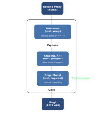

# Project Description

## Overview and Purpose

MimirsEnv is a project to deliver a turnkey solution for Mimirsbrunn.

It provides a unique interface to control and access the following resources:
- importing data into Elasticsearch
- querying Elasticsearch
- monitoring

The project was initially thought to address the need for creating testing environments on the fly.
While developing or evaluating for Mimirsbrunn, we often need to create an environment that can
take just a few words to describe, but a much longer time to prepare. We need to install
Elasticsearch, download files, invoke binaries on them with the correct command line arguments...

Instead we sought a solution with a simple interface where we could simply describe what data we
needed to evaluate, and have the interface notify us when the test environment is available.

We need potentially a couple of those test environments to be up simultaneously, maybe to
accelerate the evaluation of testing suite, or just to compare two versions of the software.

But then, this combination of functionalities could possibly find its use in a production
environment. Having been thoroughly tested, it can be used as a unit by an orchestrator.

The context surrounding the use of Mimirsenv is the following


## 1.3 Stakeholders

### 1.3.1 QA

The quality analyst is responsible for ensuring mimirsbrunn behaves according to user's
expectations, prescribed functionalities, ...

### 1.3.2 Dev

The developer is interested in maintaining the functionalities and the performance of mimirsbrunn
according to the specifications.

### 1.3.3 Devops

The DevOps Engineer wants to deploy new versions, update data

## 1.4 Product Scenarios

# 2 Architecture

## 2.1 Overview

We've identified 3 main functionalities that MimirsEnv has to implement:

- importing data into elasticsearch
- querying elasticsearch
- monitoring

We will dedicate a microservice to each functionality, and they are described in the following
sections. Although they have different roles, they are implemented on a similar template, using
a GraphQL API, a rust webserver.

In addition to these three microservices, there is an additional client component. The client makes
it possible to have a webservice, which consumes the GraphQL API of the other microservices. With
the client, the user has a simple graphical tool to interact with MimirsEnv. It is implemented as
a web application (Vue.js) served with npm.

## 2.2 Components

All the components included in MimirsEnv are seen in the following diagram, which is an exploded
view of the previous one, which described the context. So we see the same actors around Mimirsenv,
ie QA, Dev, and DevOps. They interact with MimirsEnv through a single entry point which is
a reverse proxy, allowing to dispatch to any upstream microservice based on the URL. They can be
using these services directly using the GraphQL interfaces by making HTTP requests (ie using
`curl`), or they can be using the client webapp, which hides all those microservices behind a user
interface.


### 2.2.1 Reverse Proxy

Access to the functionality of MimirsEnv is through a single access point, using a reverse proxy to
dispatch to upstream services based on the query string. nginx can fulfill this task very well with
a simple configuration file. Here is an exerpt from a configuration file

```
server {
  listen 80;
  location /mimir/graphql {
    proxy_pass        http://ctl2mimir:5000/graphql;
    [...]
  }
  location /mimir/subscriptions {
    proxy_pass        http://ctl2mimir:5000/subscriptions;
    [...]
  }
  location /status/graphql {
    proxy_pass        http://status:5001/graphql;
    [...]
  }
  [...]
```

We see that the different microservices are targeted with a different query, but for the upstream
service, the query string remains the same (`/graphql`). This make it easier to implement cookie
cutter microservices and assemble them together.

### 2.2.2 Import Controller

#### 2.2.2.1 Overview

This component is responsible for the creation of new indexes. It manages the following tasks:

* **Download data from known data providers** The goal here is to make it simple for a user to
  create new indexes, by reducing the number of tasks he has to execute to get a new index. Here
  we encapsulate the knowledge related to the data source providers, the actual download task, the
  link between the downloaded task and the next step which uses the file. We want to be sure that
  if a file is requested twice it is only downloaded once.
* **Process files using binaries from Mmirsbrunn or Cosmogony**. Again to facilitate the creation
  of an index, we hide all the command line arguments (input file, elasticsearch connection string)
* **Upload data to Elasticsearch**
* **Validate the data** This is an important step, which can be easily overlooked.

It has some level of persistence, although this is a debatable feature.

#### 2.2.2.1 API

To enable the functionality described in the previous section, we define two GraphQL entry points:
* One for the creation of an index,
* Another one for listing the indexes known to this environment


**Index Creation**

```
type Mutation {
  createIndex(index: IndexRequestBody!): IndexResponseBody!
}
```

To create an index, we require input parameters, and always return an index (or an error)

```
input IndexRequestBody {
  indexType: String!
  dataSource: String!
  region: String!
}
```

The input consist of 3 parameters:
- The type of index to create, which is either `admins`, `streets`, `addresses`, `stops`. (Note
  we're currently missing `pois`)
- The source of data, `cosmogony`, `osm`, `bano`, `ntfs`
- And finally a list of regions, like `rhone-alpes`


```json
type IndexResponseBody {
  index: Index!
}

type Index {
  indexId: Int!
  indexType: String!
  dataSource: String!
  region: String!
  status: String!
  createdAt: DateTimeUtc!
  updatedAt: DateTimeUtc!
}
```

Note that this interface should be improved:
- We should use an enumeration list for available statuses., index types, and data sources.
- We should use a list of regions instead of a single region.

Based on these parameters, the import controller should create a plan to download the correct data,
process them, and send them to Elasticsearch.

One of the characteristics of the creation of an Elasticsearch Index, is that it is possibly a time
consuming (and CPU intensive) task. This requires a mechanism by which the user is notified of
changes as they occur.

**Indexes Enumeration**

Listing indexes is a read only operation, so we use a `Query`:

```
type Query {
  indexes: MultIndexesResponseBody!
}

type MultIndexesResponseBody {
  indexes: [Index!]!
  indexesCount: Int!
}
```

**Status Updates**

Finally, since the creation of an index is an operation that can take a long time (several hours),
we want to notify the client of the progress. We use GraphQL Subscription for that:

```
type Subscription {
  notifications: IndexStatusUpdateBody!
}

type IndexStatusUpdateBody {
  id: Int!
  status: String!
}
```

The user, by subscribing to notifications, will be notified that an index identified by its id has
changed its staus.

#### 2.2.2.2 Architecture

The import controller has components for:

+----------------------------------------------------+-------------------------------+
| Purpose                                            | Implementation                |
+====================================================+===============================+
| Defining and exposing a GraphQL interface,         | * Webserver (Rust, Warp)      |
| including subscriptions.                           | * GraphQL API (Rust, Juniper) |
+----------------------------------------------------+-------------------------------+
| Message queue to enable asynchronous communication | Pub/Sub (Rust, AsyncZMQ)      |
| between components.                                |                               |
+----------------------------------------------------+-------------------------------+
| Persistence                                        | SQLite (Rust, SQLx)           |
+----------------------------------------------------+-------------------------------+
| Tasks coordination                                 | Finite State Machine (Rust)   |
+----------------------------------------------------+-------------------------------+

The following diagram shows how these components are articulated:


There are other cross-cutting components that are not shown, namely for logging and for
configuration. The components are described in the following sections

#### 2.2.2.3 Components

The components of the import controller are implemented as separate rust modules within the
source code for the import controller.

**Webserver**

See `/src/server.rs`

The webserver is using warp to serve the functionality defined by the GraphQL component. It makes
use of an excellent bridge between warp and juniper, which is the rust crate used to implement the
GraphQ?L API. The server accepts 3 routes:

+------------------+--------------------------------------------------------+
| Route            | Implements                                             |
+==================+========================================================+
| `/graphql`       | Access to the GraphQL API                              |
+------------------+--------------------------------------------------------+
| `/playground`    | Access to the playground to get a better understanding |
|                  | of the GraphQL API.                                    |
+------------------+--------------------------------------------------------+
| `/notifications` | Endpoint to receive updates via websockets.            |
+------------------+--------------------------------------------------------+

Note that the webserver currently does not implement any form of authentication or authorization,
so these are public interfaces.

These routes are supplemented by allowing any origin (CORS)

**GraphQL**

See `/src/api/graphql.rs`

The role of this API is to wrap around inner components and provide a standard GraphQL interface.
We wrap around both functional components (`index` in this case), and errors. We define a `context`
which is handed to each and every API call, and which encapsulate the state of the inner
components (logger, database connection, configuration). We also define a GraphQL Schema around the
3 standard GraphQL elements:

* **Query**:
    ```rust
    async fn indexes(&self, context: &Context)
      -> FieldResult<indexes::MultIndexesResponseBody>
    ```

* **Mutation**:
    ```rust
    async fn create_index(&self, index: indexes::IndexRequestBody, context: &Context)
      -> FieldResult<indexes::IndexResponseBody>
    ```

* **Subscription**:
    ```rust
    async fn notifications(context: &Context)
      -> IndexStatusUpdateStream
    ```

The actual types, eg `IndexResponseBody`, are defined in modules for each domain.

**Index Model**

See `/src/api/indexes.rs`, and `/src/api/model.rs`

This component implement the high level functionality used by the `GraphQL` component. It has types
to translate from the GraphQL layer to the model layer. It delegates most the actual
functionalities to lower level components:

- since we're listing indexes by reading them from the database, we delegate to the database
  component for that operation
- for the index creation, we spawn a finite state machine to handle all the logic, and subscribe
  to a message queue to receive notifations when a change of status has occured and persist them.

**Database Component**

See `/src/db/mod.rs`

Contains all the types to read from and write to a database. The connection to the database is
using a custom interface (`trait` in rust) to make the access typed and safe to use. The interface
is defined in `/src/db/model.rs`:

We model an index with types that are understood by the database library (`sqlx`) for that
particular database (`sqlite`)

```rust
pub type EntityId = i32;

pub struct IndexEntity {
    pub index_id: EntityId,
    pub index_type: String,
    pub data_source: String,
    pub region: String,
    pub status: String,
    pub created_at: DateTime<Utc>,
    pub updated_at: DateTime<Utc>,
}
```

The interface to manipulate indexes:

```rust
#[async_trait]
pub trait ProvideData {
    async fn create_index(
        &mut self,
        index_type: &str,
        data_source: &str,
        region: &str,
    ) -> ProvideResult<IndexEntity>;

    async fn get_all_indexes(&mut self) -> ProvideResult<Vec<IndexEntity>>;

    async fn update_index_status(
        &mut self,
        index_id: EntityId,
        status: &str,
    ) -> ProvideResult<IndexEntity>;
}
```

**Finite State Machine**

See `/src/fsm/mod.rs`

The finite state machine is a classic model of a reactive system. Here we define events mostly as
the asynchronous response to an action. For example, the action `download` can result in success,
so that we would emit a `downloadSuccess` event, or a failure, `downloadError`. The folllowing
diagram shows the whole FSM:


The FSM has knowledge of the message queue, so that a change of state can be published and
ultimately user notified.


### 2.2.3 Bragi GraphQL

#### 2.2.3.1 Overview

This is a simple wrapper around Bragi, which only offers a REST API (for now). So its functionality
should be the same as that of Bragi. Acually, the current implementation of BragiGraphQL is reduced
to the bare minimum: autocompletion.

#### 2.2.3.2 API

We define a single GraphQL entry point for autocompletion:

```
type Query {
  autocomplete(request: AutocompleteRequestBody!): AutocompleteResponseBody!
}

input AutocompleteParameters {
  query: String!
}

input AutocompleteRequestBody {
  parameters: AutocompleteParameters!
}

type AutocompleteResponseBody {
  resp: String!
}
```

As can be seen, this is severly lacking functionality and type:
- The response is Bragi's response, that is a complex JSON string, but here we're just passing it
  through
- The input parameters is restricted to a single query parameter, the query string. Many other
  parameters are available and should be implemented.


#### 2.2.3.4 Architecture

Following the same architecture as other microservices, the components of BragiGraphQL are seen in
the following diagram:



### 2.2.4 BragiStatus

### 2.2.5 Client

#### Overview

This is a very different component from the others. It implements a webapp to visualize and
interact with the other microservices making up Mimirsenv.
