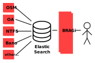

# Architecture

## Global picture

Mimirsbrunn is composed of several [parts](https://github.com/CanalTP/mimirsbrunn/blob/master/documentation/components.md): some of them manage the data import in Elasticsearch while a web service ([bragi](https://github.com/CanalTP/mimirsbrunn/blob/master/src/bin/bragi.rs)) wraps Elasticsearch interactions in order to return formated responses (using [geocodejson](https://github.com/geocoders/geocodejson-spec) as the responses format)



For more detail about the different parts, check the [components documentation](https://github.com/CanalTP/mimirsbrunn/blob/master/documentation/components.md).

Note: on the diagram:
* OSM stands for [OpenStreetMap](osm.org)
* OA stands for [OpenAddresses](openaddresses.io)
* NTFS stands for [Navitia Transit Feed Specification](https://github.com/CanalTP/navitia/blob/dev/documentation/ntfs/ntfs_0.6.md)
* Bano stands for [Base d'Adresses Nationale Ouverte](https://www.data.gouv.fr/en/datasets/base-d-adresses-nationale-ouverte-bano/)

## Indexes Architecture

Data are imported in multiple indexes with this structure:
```
munin -> munin_addr -> munin_addr_dataset1 -> munin_addr_dataset1_20160101T123200
     |             |-> munin_addr_dataset2 -> munin_addr_dataset2_20160101T123200
     |-> munin_admin  -> munin_admin_dataset1  -> munin_admin_dataset1_20160101T123200
     |-> munin_street -> munin_street_dataset1 -> munin_street_dataset1_20160101T123200
```
Munin is the root index, it's an alias used by the frontend (bragi), itself pointing to an index for each dataset/document type.  
So if we have address data for France and Belgium we will have two indexes: "addr_fr" and "addr_be". These are also aliases, they point to a dated index, this way we can import data in another index without impacting anyone, then switch the alias to point to the new data.  
This will give us the ability to only import a part of the world without any downtime.

During an update the indexes will be (for the previous example say we update addr_dataset1):

- During the data update:
  ```
                                                munin_addr_dataset1_20160201T123200
  munin -> munin_addr -> munin_addr_dataset1 -> munin_addr_dataset1_20160101T123200
       |             |-> munin_addr_dataset2 -> munin_addr_dataset2_20160101T123200
       |-> munin_admin  -> munin_admin_dataset1  -> munin_admin_dataset1_20160101T123200
       |-> munin_street -> munin_street_dataset1 -> munin_street_dataset1_20160101T123200
       |-> munin_stop   -> munin_stop_dataset1   -> munin_stop_dataset1_20160101T123200
  munin_addr_dataset1_20160201T123200
  ```

- And when the loading is finished
  ```
                                            |-> munin_addr_dataset1_20160201T123200
  munin -> munin_addr -> munin_addr_dataset1
     |               |-> munin_addr_dataset2 -> munin_addr_dataset2_20160101T123200
     |-> munin_admin  -> munin_admin_dataset1  -> munin_admin_dataset1_20160101T123200
     |-> munin_street -> munin_street_dataset1 -> munin_street_dataset1_20160101T123200
     |-> munin_stop   -> munin_stop_dataset1   -> munin_stop_dataset1_20160101T123200
   ```

There is one major drawback: dataset aren't hermetic since we import multiple OSM files, the area near the border will be in multiple dataset.  
For now we accept these duplicate. We plan on being able to filter with shape at import time and/or remove them in bragi.
