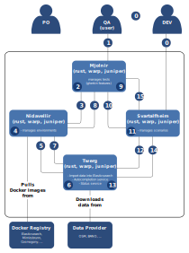

# Context

Mjolnir is the frontend service for executing (validation) tests. Tests are specified as *gherkin
features*. A feature describes both the context in which the tests are executed, and the tests
themselves. The test context is the datasets and the configuration used to obtain indexes, against
which we can run autocomplete queries. We can split the responsabilities of managing tests
environments and tests executions between two upstream services, as seen in the following diagram:


The benefit of using a number of microservices is to have not only a tool to manage tests, but also
several components that can be used separately:

- A twerg can be used as a standalone environment to run a mimirsbrunn environment. This can be
    used in other contexts, such as a production environment.
- Nidavellir can be used to manage several such twergs.
- Starvalfheim can be used separately from twergs to execute features against bragi.

# Use Case

In the following diagram we illustrate the main components and their interaction in the primary use
case, which is when a person wishes to evaluate a feature file.



## Feature file

QA, PO, and DEV get together to define tests. Tests are stored as *features* in the Gherkin
terminology.

A feature is a set of related scenarios which target a specific feature of the software.

Here, in the first step, we will add one constraint. Whereas each scenario in a feature file can
contain the description of a different test environment, we will make sure that all the scenarios
in a feature file share the *same* environment, and it will be factored out in a *background*
section.

So a scenario consists in a single background section, describing the test environment, and
multiple scenarios, each describing tests carried out in the context of that environment.

Example:

```
@regression @sanity
Feature: Some minimal acceptance tests in France

  These scenarios represent a baseline of acceptance tests for bragi

  Background:
    Given I am indexing admins with cosmogony from france
    And I am indexing streets with osm from ile-de-france
    And I am indexing addresses with bano from ile-de-france
    And I am indexing public_pois with osm from ile-de-france

  @admin @city
  Scenario: Searching for an administrative area
    When I search for 'paris'
    Then I find 'Paris' of type 'city' within the first 2 results

  @street @withAdmin @properNoun @fullSpell
  Scenario: Searching for a street using the full street name and the city
    When I search for 'rue hector malot paris'
    Then I find 'Rue Hector Malot (Paris)' of type 'street' within the first 2 results

  @street @withAdmin @properNoun @fullSpell
  Scenario: Searching for an address using the full street name and the city
    When I search for '20 rue hector malot paris'
    Then I find '20 Rue Hector Malot (Paris)' of type 'address' within the first 2 results
```

## Request Test Execution

One aspect that seems important is that the task execution be asynchronous, and that the user be
notified of the changes when they occur. The task may involve spinning a new environment, which
takes time.

In the first version of Mjolnir, we'll do just one feature (this means, one test environment,
several tests).  The interface consists in selecting a feature to upload. The file is then POSTed
by the client to a GraphQL interface `upload_feature(file)`. There is then a websocket connection
which update the interface of the progress of the operation.

## Mjolnir: Feature Extraction

Mjolnir main task is to parse the feature file into a hierarchy, identifying the background,
scenarios, and for each scenario, the steps. It stores this information.

It then sends the background description to Nidavellir to request an environment.

## Request Environment

Mjolnir requests an environment (aka twerg) from Nidavellir.
It expects, in return, a twerg id, the port it is available on, and its status.

## Nidavellir: Twerg creation

Nidavellir main task is to requests docker images from the registry, and create containers.

It identifies a port available for the twerg's frontend.

It maintains a database, with, on one side, a twerg description, and, on the other,
the id and the port the twerg is available on. If no twerg is available with the given
configuration, we create a new one.

To create a new twerg, Nidavellir has a connection to the docker engine (typically, on Unix
machines, this is with `/var/sock...`). It also needs a connection to a docker registry to pull
images from.

## Twerg: Data Ingestion

The twerg iterate over the description of the indexes, and pulls the data from the data provider,
and processes them to create the indexes in Elasticsearch.

## Starvalfheim: Scenario processing

When Mjolnir is notified that the twerg is ready, it sends the port along with the scenarios to
Starvalfheim. Starvalheim iterates over the scenarios, and translate them to request similar to
Bragi. It sends them to the port processes the result to produce the a report for that scenario.

# TODO

* Look at [postgres unit testing](https://www.bigsmoke.us/postgresql-unit-testing/) for adding some
in nidavellir-db.
