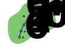
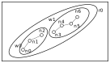

Mimirsbrunn is a geocoder, and it can return a few different kind of places from a user's query:
- **administrative region**, like a city, a state. It is usually abbreviated 'admin' in the rest of
  this document.
- **street**, like '4th Avenue', 'Avenue des Champs-Elysées'.
- **address**, like '10 Downing Street'.
- **point** of interest, like 'Eiffel Tower'
- **stop**, which can be a train station, a bus stop, ...

This article focuses on streets, and we try to understand
1. What we're trying to get when indexing streets
2. What are the challenges we face to accomplish (1)
3. The code used to implement (2)

# Geocoding and Streets 

Let's imagine you're in front of the map (the one that's displayed on a screen, because the one on
paper won't talk back that much), and you start typing the name of your favorite street. What do
you expect? Since the geocoder will start working as soon as you type a few characters, you may not
have even finished typing your street name that you will be presented with a list of candidates.

I hope I would find the name of my street toward the top of the list. Certainly, if I type more
characters, I would like the list to get narrower, and my street to get closer to the top. I would
also expect to find other streets with the same name, but from a different city. So, to
differentiate between them, I'd like to have the street's context, like a city name, or more
generally an administrative name that would allow me to differentiate between two streets with the
same name.

I would also expect the streets nearby to be given more importance, provided I submited the
position from where I searched for the street.

# Streets and OSM

Getting a list of streets from OSM does not seem like a complicated task at first. From OSM's
[description](https://wiki.openstreetmap.org/wiki/Elements) of the elements that compose the model,
we have the following list:

- **node**: A point in space
- **way**: A linear feature, essentially a list of nodes forming a polyline.
- **relation**: A set of elements, related to each other.

So a street could be either a single *way*, or a *relation* binding several *way*s together, as
seen in the drawings below. The latter could occur if, for example, a street would go over a bridge,
or cross different administrative regions, so sections of the streets are different from one
another.



Here is probably the most straightforward case: We have a way $w_0$ comprised of 6 nodes
$n_{0..5}$, embedded in a single administrative region $a_0$.


A slightly more complicated case, illustrating a case where a street crosses admins. So there are
two ways, $w_0$ and $w_1$


If we were to just derive the list of streets from the list of *way*s, we would obtain lots
of duplicates with the geocoder, as seen in the drawing below.


In the drawing below, the street identified by `r0` is composed of 2 ways, `w0` and `w1`. Without
proper treatment, searching for that street with the geocoder, would yield two results, one for
`w0`, and one for `w1`. The would be labelled the same, which would seem strange for the user.



Then there are fringe cases, like streets crossing between two neighbouring administrative areas,
streets that are the frontier between two areas...

All this makes for a challenging problem, and this document proposes to investigate the algorithm
used to identify streets, and list possible test cases to make sure the algorithm works.

## Algorithm

The main idea is:

- first, get a list of all the streets
- second, remove duplicates from that list.

We'll test the algorithms against some fringe cases to see how it is behaving, and also what
happens when the data does not meet our assumptions, which does happen!

### All the streets

**Assumption 01**: We're only interested in streets that are part of a relation.

**TODO** Why this assumption

Our starting point is an OSM file in [PBF
Format](https://wiki.openstreetmap.org/wiki/PBF_Format). These files can be
downloaded from [Geofabrik](http://download.geofabrik.de/). We'll make use of
the [osmpbfreader](https://docs.rs/osmpbfreader/) crate to read from that file.

```rust
let pbf_path = PathBuf::from("region-latest.osm.pbf");
let file = File::open(pbf_path).context(error::IOError)?;    // This is Snafu, but you can
                                                             // use something else
let reader = BufReader::new(file);
let mut pbf = osmpbfreader::OsmPbfReader::new(reader);
let objs_map = pbf
    .get_objs_and_deps(is_valid_way)
    .context(error::OSMPBFError)?;                           // Snafu again...
```

This gives us a `BTreeMap<OsmId, OsmObj>`, in other words a dictionary of OSM objects indexed by
their id. According to our assumption 01, to get a list of all the streets, we'll list all the
relations, and for each relation, we'll look at the members of that relation. If they are streets,
we'll store them in a temporary data structure.

The closure `is_valid_way` is a filter on what constitutes a valid street. For our case, we want to
remove certain kind of streets that are not relevant for geocoding. OSM has a very simple yet rich
tagging mechanism, and streets can be of many different kinds, listed
[here](https://wiki.openstreetmap.org/wiki/Key:highway).

+------------+-----------------------------------------------------------+
| OSM Object | Rules                                                     |
+============+===========================================================+
| way        | * Must have a `highway` tag.                              |
|            | * The `highway` tag value must not be part of the list of |
|            | invalid highways (see below).                             |
|            | * Must have a `name` tag.                                 |
|            | * The `name` tag value must not be empty.                 |
+------------+-----------------------------------------------------------+
| relation   | * Must have a `type` tag.                                 |
|            | * The `type` tag value must be `associatedStreet`         |
+------------+-----------------------------------------------------------+
| node       | * invalid.                                                |
+------------+-----------------------------------------------------------+

**Note** This predicate does not exclude from the `BTreeMap` dependencies that would otherwise return
false with that predicate. For example, if a (valid) street depends on nodes (which are invalid
according to the rules we layed in the table), these nodes will still be inserted in the BTreeMap.

Here is the implementation of that predicate:

```rust
const INVALID_HIGHWAY: &'static [&'static str] =
    &["bus_guideway", "escape", "bus_stop", "elevator", "platform"];

fn is_valid_way(obj: &osmpbfreader::OsmObj) -> bool {
    match *obj {
        osmpbfreader::OsmObj::Way(ref way) => {
            way.tags.get("highway").map_or(false, |v| {
                !v.is_empty() && !INVALID_HIGHWAY.iter().any(|&k| k == v)
            }) && way.tags.get("name").map_or(false, |v| !v.is_empty())
        }
        osmpbfreader::OsmObj::Relation(ref rel) => rel
            .tags
            .get("type")
            .map_or(false, |v| v == "associatedStreet"),
        _ => false,
    }
}
```

Back to our `BTreeMap<OsmId, OsmObj>`, from which we need to extract the list of relations.
We start by listing all the values (`OsmObj`) from the `BTreeMap`, and filter out all objects
that are not relations. The function `OsmObj::relation()` conveniently returns `Option<Relation>`
if the object is a relation, or `None` if it not, which works great with
  [`filter_map`](https://doc.rust-lang.org/std/iter/trait.Iterator.html#method.filter_map)

```rust
let streets = objs_map
    .values()
    .filter_map(|val| val.relation())             // We look for relations
    .map(|rel| get_streets(&objs_map, rel))
    .flatten()
    .collect::<Vec<_>>();
```

The function `get_streets()` that we'll investigate soon returns a vector of streets, so that
we end up with a vector of vectors of streets, hence the call to flatten.

So what's in our streets. Let's keep it simple first: we want to store the street's name, it's
`OsmId`, and the list of nodes that make up the street. We're not particularly interested in the
nodes, just their coordinates.

```rust
#[derive(Debug, PartialEq, Clone, Serialize, Deserialize)]
struct Street {
    id: i64,
    name: String,
    nodes: Vec<geo::Point<f64>>,
}
```

So now we can get on with the function that, given a relation, will return the list of streets that
belong to that relation. The signature of the function is

```rust
fn get_streets(
    objs_map: &BTreeMap<OsmId, OsmObj>,
    rel: &osmpbfreader::objects::Relation,
) -> Vec<Result<Street, error::Error>> {
```

It's pretty easy to get the list of all the members of a relation that are `ways`. The following
gives us an iterator of `WayId` that are part of `rel`. Again, it uses the fact that `way()`
returns an `Option<WayId>`.

```rust
rel
    .refs
    .iter()
    .filter_map(|r| {
        if r.member.is_way() && r.role == "street" {
            r.member.way()
        } else {
            None
        }
    })
```

We must now look up that way_id in the `BTreeMap`, and extract all the relevant information, namely
the name of that way, and the coordinates of all the nodes.

```rust
let way_obj = objs_map.get(&OsmId::Way(way_id))
    .ok_or(error::Error::UserError {
        details: format!("While looking for streets for relation {}, the id {} could not be seen in the object store", rel.id.0, way_id.0)
    })?;
let way = way_obj.way()
    .ok_or(error::Error::UserError {
        details: format!("While looking for streets for relation {}, the id {} should have been a node", rel.id.0, way_id.0)
    })?;
let way_name = way.tags.get("name")
    .ok_or(error::Error::UserError { details: format!("Could not find tag name for way {}", way_id.0) })?;
```

Here we have succesively retrieved the `OsmObj` corresponding to `way_id`, the way, and the way
name. We make use of rust's `Result` and `Option` to bail out and return an error if something goes
awry. We follow a similar course for retrieving the nodes and their coordinates:

```rust
// We create a vec<result<point, error>>.
let nodes = way.nodes.iter().map(|node_id| {
    let node_obj = objs_map.get(&OsmId::Node(*node_id))
        .ok_or(error::Error::UserError {
            details: format!("While looking for nodes for way {}, the id {} could not be seen in the object store", way_id.0, node_id.0)
        })?;
    let node = node_obj.node()
        .ok_or(error::Error::UserError {
            details: format!("While looking for nodes for way {}, the id {} should have been a node", way_id.0, node_id.0)
        })?;
    Ok(geo::Point::new(node.lat(), node.lon()))
})
```

Now we just log an error if an error occured while getting the nodes, and return the vector of
points.

```rust
let nodes =
    [...]
    .filter_map(|res_point: Result<geo::Point<f64>, error::Error> | match res_point {
        Ok(point) => Some(point),
        Err(err) => {
            error!("{}", err);
            None
        }
    }).collect::<Vec<_>>();

Ok(Street {
    id: way_id.0,
    name: String::from(way_name),
    nodes,
})
```

All these structures (`Point`, `Street`) are `Serialize`, so we can use eg `serde_json` to show
a list of streets, we get results like:

```json
{
  "id": 106114696,
  "name": "Place Jean Jaurès",
  "nodes": [
    {
      "x": 50.2734539,
      "y": 2.7578521
    },
    {
      "x": 50.273552099999996,
      "y": 2.7577563
    },
    [...]
  ]
}
```

With that we've completed the first task, that is to get a list of all the streets from an OSM
file. Some of those streets may be duplicate of each other, and we'll see in the next section how
to remove duplicates.

### Removing duplicates.

We can see duplicates for a number of reason. Remember the previous diagram showing a relation with two ways.


We have two ways, with the same name

## Identifying problems

The following figure illustrate the situation where a street crosses between two regions back and forth. One section belongs
to a specific area, the next section belongs to another, the next belongs to the first area...


The street forms a single relation, with many ways for each section of the street.

In the following figure, we have a street straddling the border between
two zones, `z0` and `z1`. In that case, we have to figure out if the two zones are
worth distinguishing, and to make this decision we need to know about the administrative level of these zones.


[Administrative regions](/doc/6449b701-5cd0-45ef-b111-53d7848588e1#admin) have
a level which position them in a hierarchy. For example in the US, the country
form a region, below there are states, in each states there are counties, and
so on. At the lowest level of that hierarchy we may have neighborhoods.

### Ways that are not part of a relation


